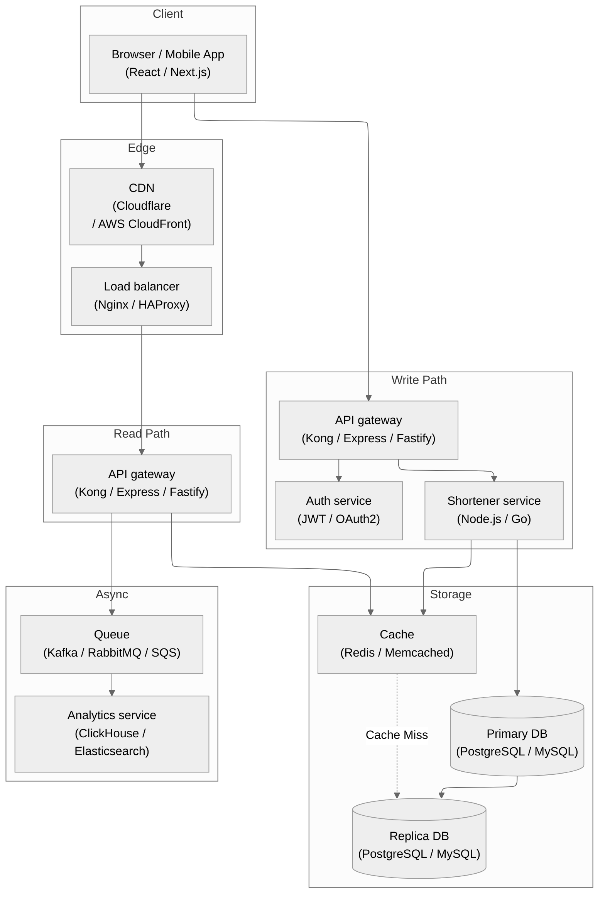

# High-Level Architecture

```mermaid
---
config:
  layout: elk
  theme: neutral
---
flowchart TB

    subgraph Client
        User["Browser / Mobile App<br/>(React / Next.js)"]
    end

    subgraph Edge
        CDN["CDN<br/>(Cloudflare<br/> / AWS CloudFront)"]
        LB["Load balancer<br/>(Nginx / HAProxy)"]
    end

    subgraph WritePath["Write Path"]
        APIGW["API gateway<br/>(Kong / Express / Fastify)"]
        Auth["Auth service<br/>(JWT / OAuth2)"]
        Shortener["Shortener service<br/>(Node.js / Go)"]
    end

    subgraph ReadPath["Read Path"]
        Redirect["API gateway<br/>(Kong / Express / Fastify)"]
    end

    subgraph Storage
        Redis["Cache<br/>(Redis / Memcached)"]
        Primary[("Primary DB<br/>(PostgreSQL / MySQL)")]
        Replica[("Replica DB<br/>(PostgreSQL / MySQL)")]
    end

    subgraph Async
        Queue["Queue<br/>(Kafka / RabbitMQ / SQS)"]
        Analytics["Analytics service<br/>(ClickHouse / Elasticsearch)"]
    end

    User --> APIGW
    APIGW --> Auth
    APIGW --> Shortener

    Shortener --> Redis
    Shortener --> Primary

    Primary --> Replica

    User --> CDN
    CDN --> LB
    LB --> Redirect

    Redirect --> Redis
    Redis -. Cache Miss .-> Replica

    Redirect --> Queue
    Queue --> Analytics
```
