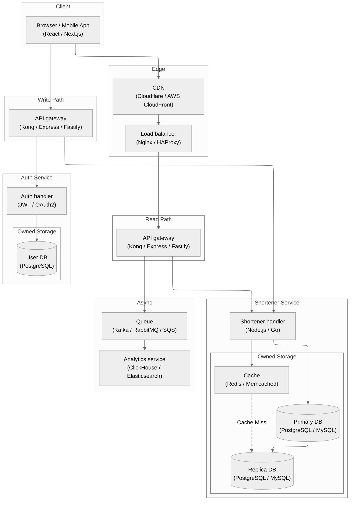
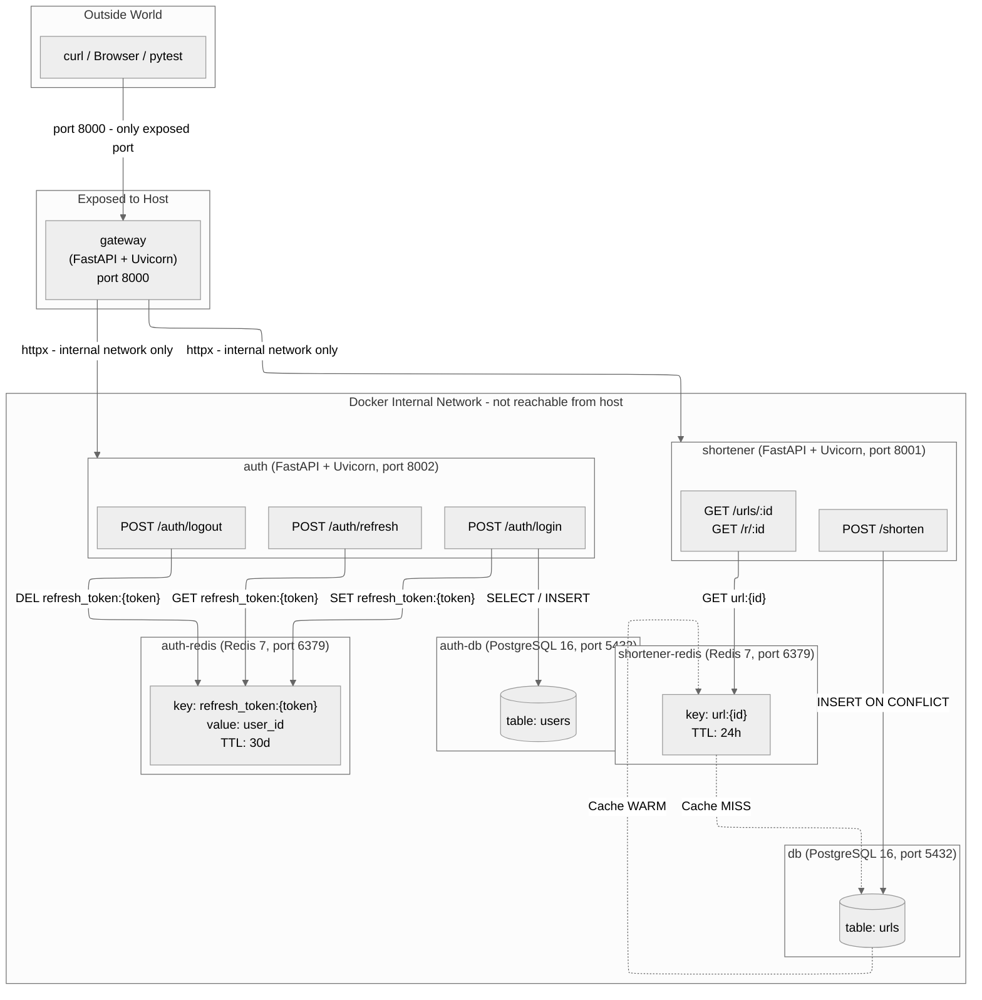

# High-Level Architecture

> This diagram shows the **target production design**

---

# Container Design

> Shows the **running containers**, which communicate only over the internal Docker bridge network, and what is exposed to the outside world.

