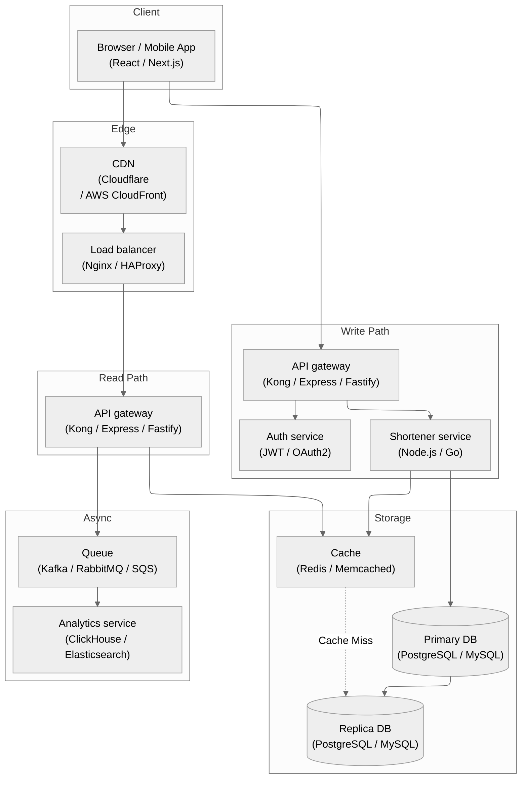
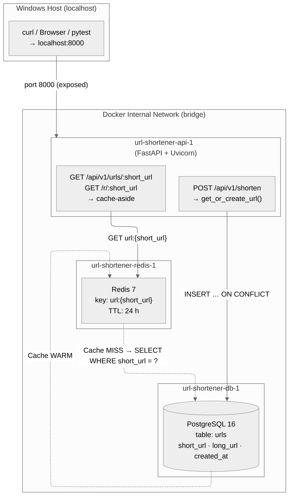

# High-Level Architecture

> This diagram shows the **target production design** 

```mermaid
---
config:
  layout: elk
  theme: neutral
---
flowchart TB

    subgraph Client
        User["Browser / Mobile App<br/>(React / Next.js)"]
    end

    subgraph Edge
        CDN["CDN<br/>(Cloudflare<br/> / AWS CloudFront)"]
        LB["Load balancer<br/>(Nginx / HAProxy)"]
    end

    subgraph WritePath["Write Path"]
        APIGW["API gateway<br/>(Kong / Express / Fastify)"]
        Auth["Auth service<br/>(JWT / OAuth2)"]
        Shortener["Shortener service<br/>(Node.js / Go)"]
    end

    subgraph ReadPath["Read Path"]
        Redirect["API gateway<br/>(Kong / Express / Fastify)"]
    end

    subgraph Storage
        Redis["Cache<br/>(Redis / Memcached)"]
        Primary[("Primary DB<br/>(PostgreSQL / MySQL)")]
        Replica[("Replica DB<br/>(PostgreSQL / MySQL)")]
    end

    subgraph Async
        Queue["Queue<br/>(Kafka / RabbitMQ / SQS)"]
        Analytics["Analytics service<br/>(ClickHouse / Elasticsearch)"]
    end

    User --> APIGW
    APIGW --> Auth
    APIGW --> Shortener

    Shortener --> Redis
    Shortener --> Primary

    Primary --> Replica

    User --> CDN
    CDN --> LB
    LB --> Redirect

    Redirect --> Redis
    Redis -. Cache Miss .-> Replica

    Redirect --> Queue
    Queue --> Analytics
```

---

# Current Implementation

> This diagram shows **what is actually built right now** 

```mermaid
---
config:
  layout: elk
  theme: neutral
---
flowchart TB

    subgraph Host["Windows Host (localhost)"]
        Dev["curl / Browser / pytest<br/>→ localhost:8000"]
    end

    subgraph DockerNetwork["Docker Internal Network (bridge)"]

        subgraph API["url-shortener-api-1<br/>(FastAPI + Uvicorn)"]
            direction TB
            WriteHandler["POST /api/v1/shorten<br/>→ get_or_create_url()"]
            ReadHandler["GET /api/v1/urls/:short_url<br/>GET /r/:short_url<br/>→ cache-aside"]
        end

        subgraph Cache["url-shortener-redis-1"]
            RedisStore["Redis 7<br/>key: url:{short_url}<br/>TTL: 24 h"]
        end

        subgraph DB["url-shortener-db-1"]
            Postgres[("PostgreSQL 16<br/>table: urls<br/>short_url · long_url · created_at")]
        end

    end

    Dev -->|"port 8000 (exposed)"| API

    WriteHandler -->|"INSERT … ON CONFLICT"| Postgres
    ReadHandler -->|"GET url:{short_url}"| RedisStore
    RedisStore -.->|"Cache MISS → SELECT WHERE short_url = ?"| Postgres
    Postgres -.->|"Cache WARM"| RedisStore
```
