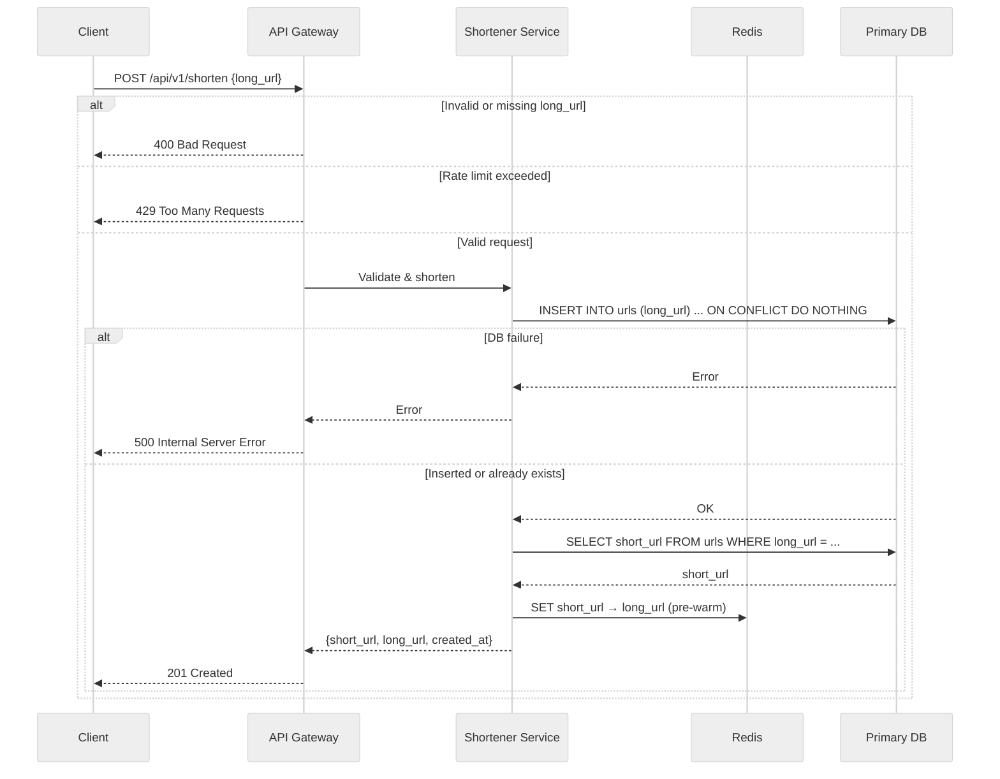

# Write Path API
### Flow

```mermaid
---
config:
  layout: elk
  theme: neutral
---
sequenceDiagram
    participant C as Client
    participant A as API Gateway
    participant S as Shortener Service
    participant R as Redis
    participant DB as Primary DB

    C ->> A: POST /api/v1/shorten {long_url}
    alt Invalid or missing long_url
        A -->> C: 400 Bad Request
    else Rate limit exceeded
        A -->> C: 429 Too Many Requests
    else Valid request
        A ->> S: Validate & shorten
        S ->> DB: INSERT INTO urls (long_url) ... ON CONFLICT DO NOTHING
        alt DB failure
            DB -->> S: Error
            S -->> A: Error
            A -->> C: 500 Internal Server Error
        else Inserted or already exists
            DB -->> S: OK
            S ->> DB: SELECT short_url FROM urls WHERE long_url = ...
            DB -->> S: short_url
            S ->> R: SET short_url → long_url (pre-warm)
            S -->> A: {short_url, long_url, created_at}
            A -->> C: 201 Created
        end
    end
```

