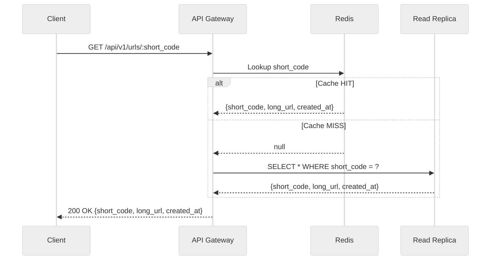

### Flow

```mermaid
---
config:
  layout: elk
  theme: neutral
---
sequenceDiagram
    participant C as Client
    participant A as API Gateway
    participant R as Redis
    participant DB as Read Replica

    C ->> A: GET /api/v1/urls/:short_code
    A ->> R: Lookup short_code
    alt Cache HIT
        R -->> A: {short_code, long_url, created_at}
    else Cache MISS
        R -->> A: null
        A ->> DB: SELECT * WHERE short_code = ?
        DB -->> A: {short_code, long_url, created_at}
    end
    A -->> C: 200 OK {short_code, long_url, created_at}
```

