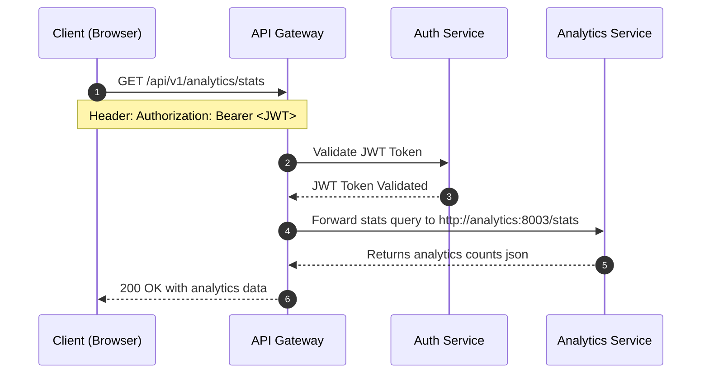

# Analytics Service Design

This document details the design and event-driven architecture of the **Analytics Service** using **Apache Kafka** as the asynchronous message broker.

## 1. Redirect Tracking & Event Processing Flow

When a user accesses a shortened link, the read path processes the redirect immediately. It then publishes an event to Kafka asynchronously to ensure zero impact on the redirect latency.

```mermaid
sequenceDiagram
    autonumber
    participant C as Client (Browser)
    participant G as API Gateway
    participant S as Shortener Service
    participant K as Kafka Broker
    participant A as Analytics Service

    C->>G: GET /r/{short_url}
    G->>S: Forward to Shortener
    S->>S: Fetch URL (Redis Cache or Postgres)
    S-->>G: HTTP 302 (Redirect Target)
    G-->>C: Redirect Target (Zero Latency Overhead)

    Note over S,K: Async Event Dispatch (Background Task)
    S-)+K: Publish Event "url-redirects" {short_url, event: redirect}
    deactivate S

    Note over K,A: Event Ingestion (Background Consumer)
    K-)+A: Push Event to Consumer
    A->>A: Update In-Memory Counts (total_redirects, redirects_by_short_url)
    deactivate A
```

---

## 2. Analytics Retrieval Flow

The client retrieves analytics data via the API Gateway. The gateway validates the JWT token and proxies the stats request to the analytics container.



---

## 3. Data Schema

### Kafka Event Structure
The message published on the `url-redirects` topic is a serialized JSON payload containing:

```json
{
  "short_url": 12345,
  "event": "redirect"
}
```

### Stats API Payload Structure
The HTTP endpoint `/stats` returns a summary of the captured statistics:

```json
{
  "total_redirects": 1,
  "redirects_by_short_url": {
    "12345": 1
  }
}
```
