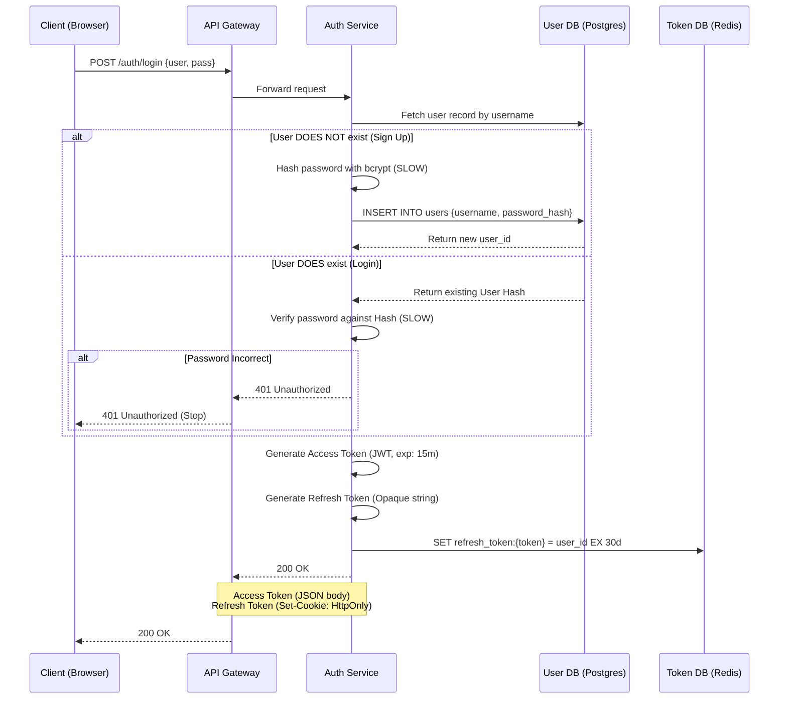
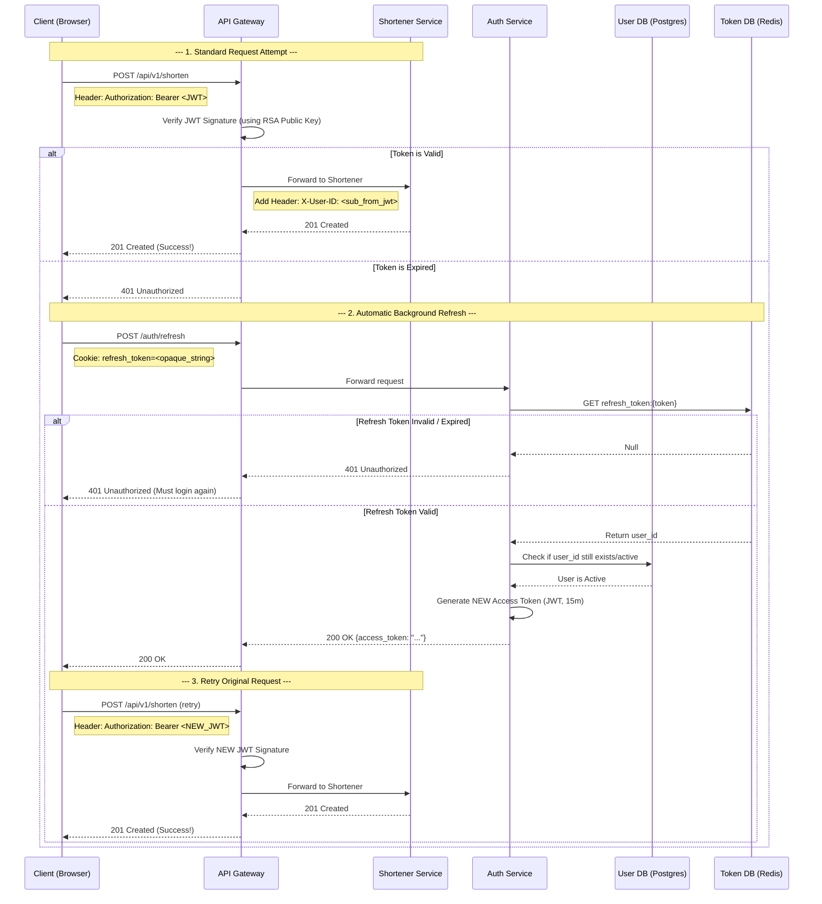
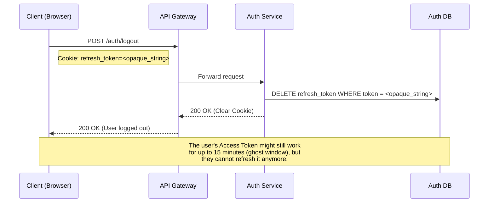

# Auth Service Design

This document details the authentication flow using the **Short-Lived Access Token + Long-Lived Refresh Token** pattern.

## 1. Sign Up / Login & Token Issuance Flow

## 2. Standard API Request & Background Refresh Flow

This diagram shows what happens during a standard API request. If the access token is expired, the client automatically handles it by using the refresh token in the background to get a new access token, and then retries the original request.

## 3. Logout / Revocation Flow

When the user logs out, we immediately delete the Refresh Token.

