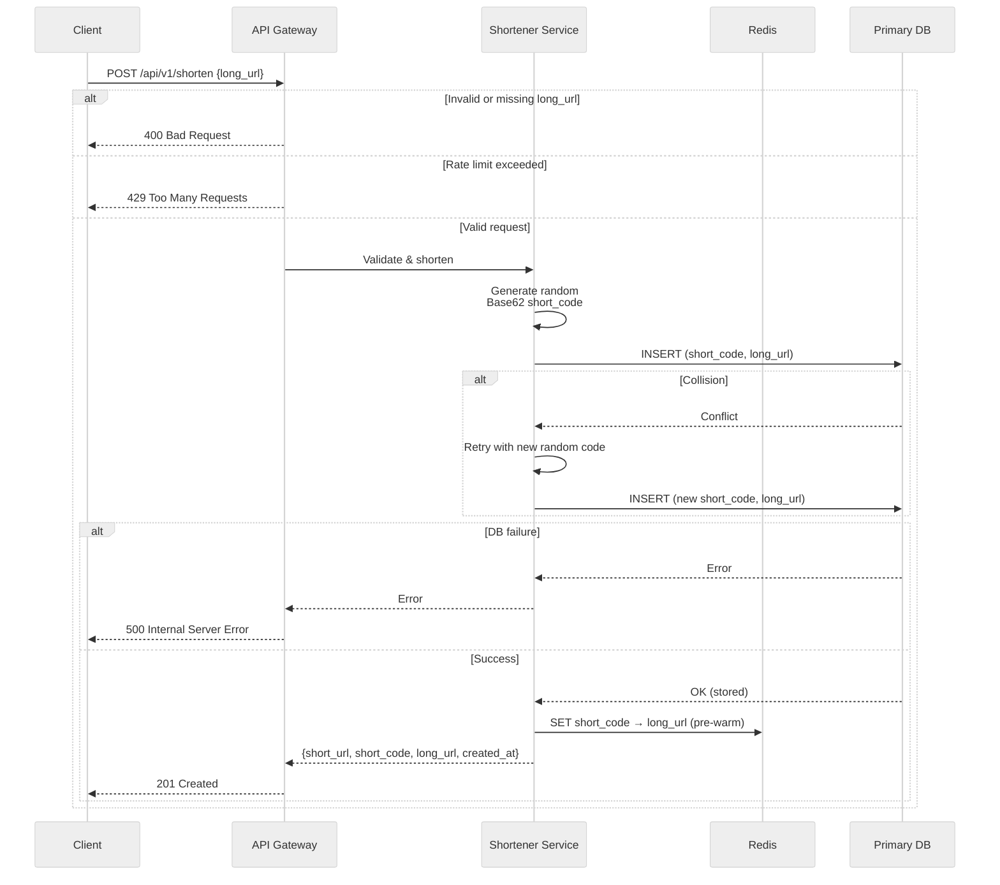

# Write Path API
### Flow

## Short Code Generation

### Approach: Random Base62 String

Each new URL gets a unique short code by picking 7 random characters from the Base62 alphabet (`a–z`, `A–Z`, `0–9`).

- 7 characters give roughly 3.5 trillion possible codes (62⁷), plenty of room before collisions become likely.
- The system checks for collisions and retries with a new random code if one occurs.

### Why Base62?

The short code is used as the primary key for all database lookups and index scans. The Base62 alphabet (`a–z`, `A–Z`, `0–9`) keeps the character set small and uniform, which means:

- **Fast index lookups** — simple byte-level comparison with no multi-byte or special-character edge cases.
- **Compact index size** — smaller B-tree nodes, better cache utilization.
- **URL-safe by default** — The Base62 alphabet consists solely of alphanumeric characters, avoiding reserved URL characters (such as `+`, `/`, `=`, or `-`). This ensures the short code can be embedded directly in URLs without requiring percent-encoding, keeping links clean and readable.

