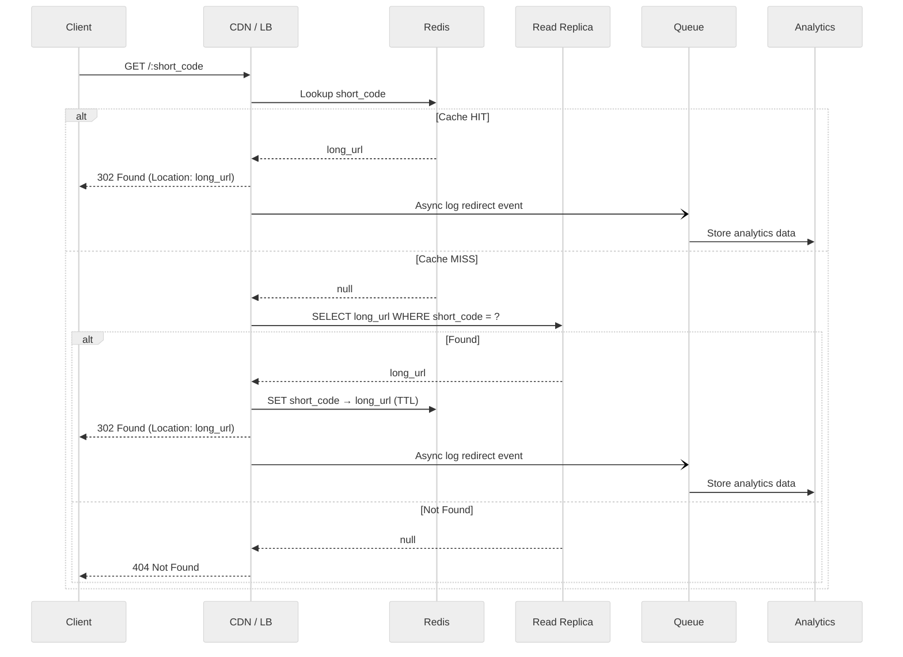
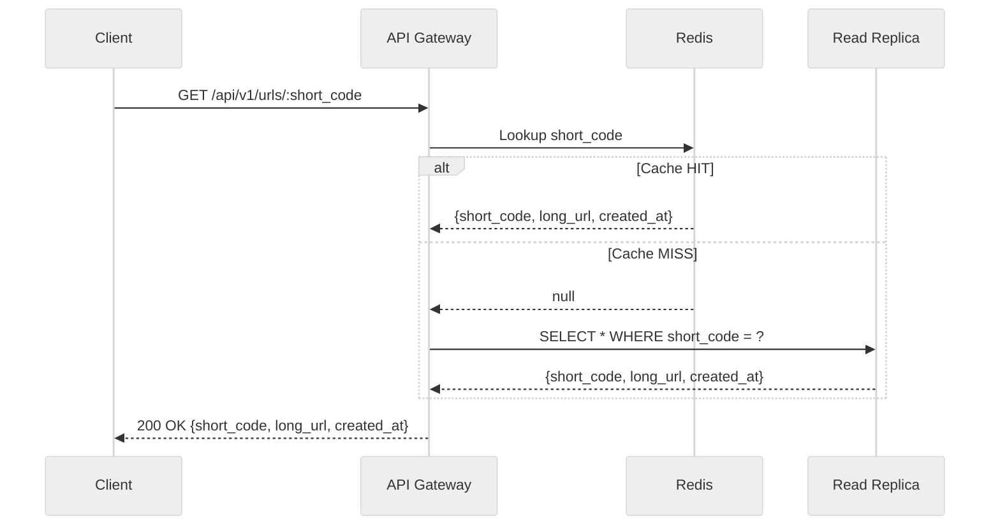

### Flow




### Redirect Strategy: 301 vs 302

- **302 (Temporary) Redirect** — Recommended default
  - Does not cache the redirect in browsers/CDNs.
  - Allows tracking/analytics on each visit.
  - More flexible if the target URL needs to change later.

- **301 (Permanent) Redirect** — Alternative
  - Browser caches the redirect permanently.
  - Reduces server load but loses analytics capability.
  - Better for pure performance if analytics are not needed.

**Recommendation**: Use **302** by default for flexibility; offer 301 as an option.

## Get URL Info

Retrieves metadata about a short URL without redirecting.

### Endpoint

```
GET /api/v1/urls/:short_code
```

### Response (200 OK)

```json
{
    "short_code": "a3fX9kZ",
    "long_url": "https://www.example.com/very/long/path?query=param",
    "created_at": "2026-06-24T12:00:00Z"
}
```

### Flow



1. Receive request for `/api/v1/urls/:short_code`.
2. Check **Redis cache**.
   - **Cache HIT**: Return URL metadata.
   - **Cache MISS**: Query the **read replica database**.
3. If found, return metadata. If not found, return 404.

### Error Responses

```
404 Not Found - Short code does not exist
429 Too Many Requests - Rate limit exceeded
500 Internal Server Error
```
